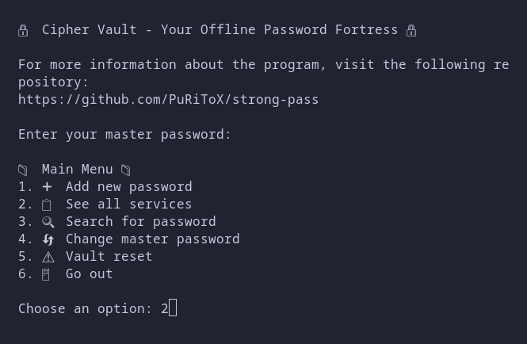
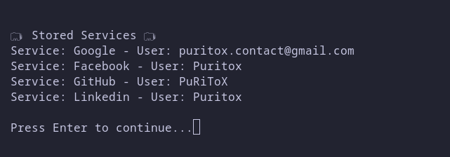

# 🔒 CipherVault - Your Offline Password Fortress 🔒

 Your digital keys, encrypted offline  
 A secure, open-source password manager for those who value true privacy



 CipherVault is an offline password manager designed for users who prioritize absolute security and privacy. Developed in Python, it offers a reliable alternative to cloud solutions through end-to-end military-grade encryption, local storage, and auditable open source code. Its multi-layered architecture combines bcrypt for authentication, PBKDF2 for key derivation, and AES-256 via Fernet, ensuring that even physical access to files does not compromise the data. 
 


 It operates completely offline, eliminating the risk of remote leakage, and protects data with advanced measures such as automatic encrypted backups, OS-level file protection, and secure master password rotation. The intuitive CLI interface allows you to manage credentials, generate strong passwords, and quickly search for entries, while its integrity system detects unauthorized modifications. 
 
 Ideal for security-conscious technicians and users, CipherVault operates without telemetry, external services, or cloud dependencies, storing everything locally in encrypted format. Its modular design and transparent documentation allow you to verify every aspect of its operation, offering digital peace of mind in a world of constant vulnerability.

[](https://www.python.org/)
[](https://opensource.org/licenses/MIT)
[](https://github.com/yourusername/ciphervault/blob/main/requirements.txt)


## ✨ Features

- **Military-grade Encryption**  
  🔐 AES-256 + HMAC-SHA256 via Fernet  
  🔑 PBKDF2 key derivation (100,000 iterations)

- **Complete Offline Operation**  
  🌐 No internet required - No tracking - No phoning home

- **Advanced Security Protections (Not available now)**  
  🛡️ Automatic backups with separate encryption  
  🕵️♂️ Hidden file storage and OS-level protection  
  🔄 Master password rotation system 

- **Smart Data Management (Not available now)**  
  📂 Multiple storage redundancy  
  ✅ Integrity checks with SHA3-256  
  ⚠️ Tamper detection system

- **Privacy First**  
  🚫 No telemetry - No cloud sync - Zero third-party services

## 🚀 Installation

## Requirements
- Python 3.8+
- pip package manager

## Quick Start
```bash
# Clone repository
git clone https://github.com/puritox/cipher-vault.git
cd cipher-vault/

# Install external python modules
pip install bcrypt
pip install cryptography

# Launch CipherVault
python main.py

``` 
## 🔄 Usage Workflow

1. First Run

```bash
$ python main.py
```
#2- Main Menu

```plaintext
--- CipherVault Main Menu ---
1 ➕ Add New Password
2 📋 List Services
3 🔍 Search Passwords  
4 🔄 Change Master Key
5 🛡️ Backup Management
6 ⚠️ Factory Reset
7 🚪 Exit
```

## ❓ FAQ

Q: What if I forget my master password?
A: Without the password, your data remains securely encrypted and inaccessible. No backdoor exists.

Q: How secure are the backup files?
A: Backups use independent encryption keys and require your master password for restoration.

Q: Can I use CipherVault across multiple devices?
A: Yes - manually copy the config.json and vault.json files between devices.

Q: How do I update to new versions?
A: Always back up your vault first. Replace program files while keeping your data files.

## 🤝 Contributing

We welcome security researchers and developers!
Please read our Contribution Guidelines and:

    Report vulnerabilities via puritox.contact@gmail.com

    Follow responsible disclosure principles

### 📜 License

MIT License - See LICENSE for full text

CipherVault 🔒 - Because your digital life deserves a good security